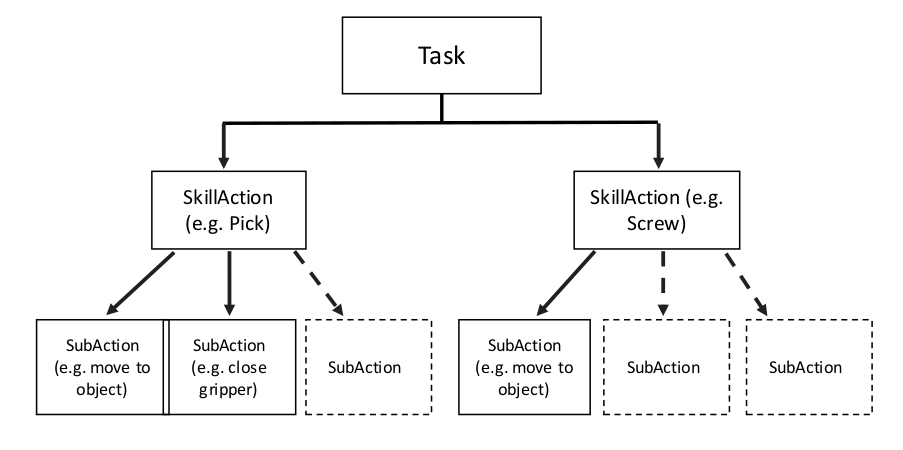
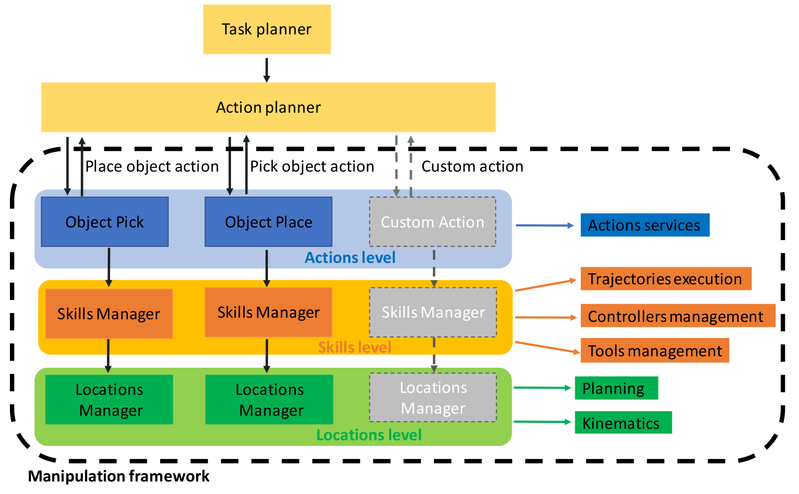
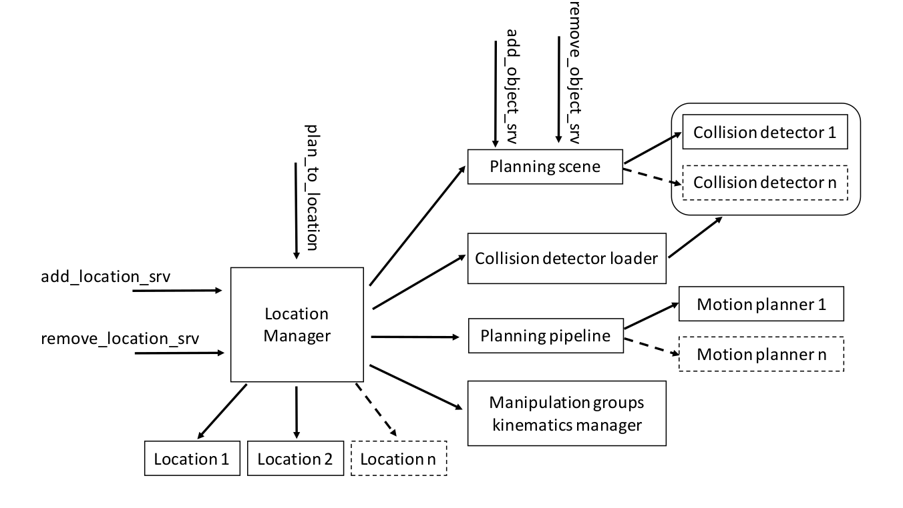
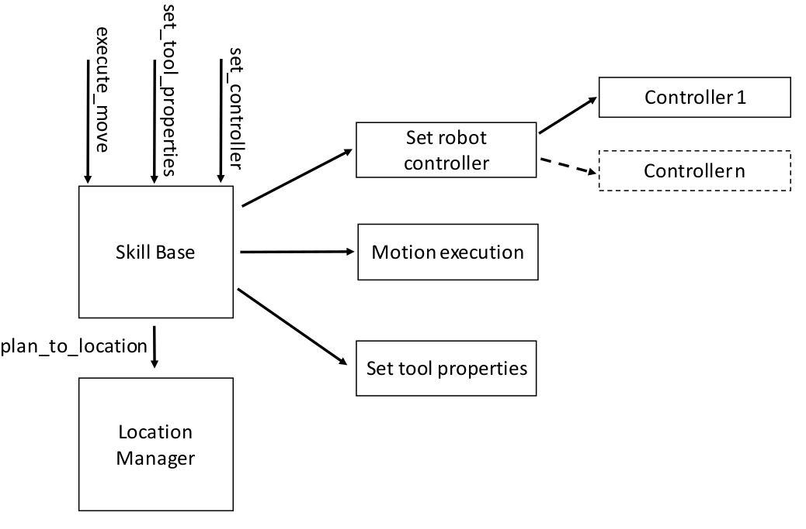
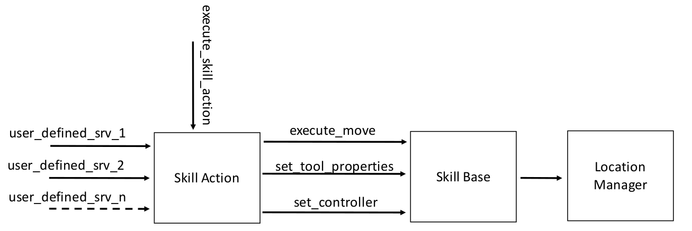

# manipulation_utils #

The manipulation_utils package implements all the basic modules to build a Skill Action.

## Description

The following definitions are used for the manipulation framework modules explanation:

- *Task*: is the final goal to be reached by the robotic system represented by a group of *Skill Actions*. The *Task* decomposition into single *Skill Action* is made by a task planner, or by an action planner if present, that assign single *Skill Action* to the manipulation framework.

- *Skill Action*: is a single action that represent an elementary skill such as pick, place, screw, etc....

- *Sub Action*: is the elementary movement executed by the robotic system, a group of *Sub Action* forms a *Skill Action*. For example, the pick *Skill Action* can bedecomposed in: move to approach position, move to object position, actuate the grasping system, move to leave position.

The Task decomposition previously described is reported in the following picture:

The manipulation framework layers are represented in the following picture:

The manipulation framework is made by three main layers: the bottom layer (the green layer) has in charge the geometrical information management and the motion planning. The intermediate layer (the orange layer) manages the trajectories execution, the robot controllers and tools management. Finally, the top layer (the blue layer) deals with the *Skill Actions* decomposition and the *Sub Actions* execution.

The action planner can add and remove dynamically *Skill Actions* and multiple *Skill Actios* can contemporary exists. 

The scheduling of the actions is in charge to the action planner or to a task planner, in general, the framework can be used by the user even without the presence of planners on the above levels, by simply exploiting the powerful motion planning and motion control functionalities.

All the object that need to be manipulated can be described by the data structure *Location* for a generic manipulation pose (position + orientation) (see ../manipulation_msgs/msg). The *Location Manager* is the module that has in charge the management of multiple *Locations* :

The *Location Manager* embeds a *MoveIt!* planning pipeline that enable the use the of multiple motion planners, a *MoveIt!* planning scene and a kinematics module able to compute the inverse kinematics of the overall robotic system for a given *Location*. Every time a new *Location* is added the inverse kinematics for a given move group (robotic arm + grasping system) is computed and stored. The planning scene is evaluated only one time before planning a new trajectory, the online trajectory replanning is not supported, when a new trajectory planning is required the planning scene is updated and used for the planning. The trajectory planning is made avoiding collisions between the robotic system and all the entities in the planning environment. The motion planners can be loaded as ROS plugins, as the collision detectors.

A *Location Manager* can handles multiple move groups. The planning scene is unique and shared between multiple *Location Manager*, objects can be dynamically added or removed depending on the real scene evolution, a perception system can be used to this scope. 

The *Skill Base* module allows to dynamically load/unload the robot controllers depending on the required robot behaviour during the execution of a specific *Sub Action*. The module allows to start and monitor the execution of the trajectories planned by the *Location Manager* for a specific move group and enable the control of the tool required by the *Skill Actions*.

The *Skill Action* ground on the top of the modules *Skill Base* and *Location Manager* defining the following pipeline:

The *Skill Action* need to be defined by the user, as for the services to interact with the module. Once a new action is taken in charge, the *Skill Action* module supervises the action execution, checks if all the *Sub Actions* are properly completed and partially manages unexpected behaviours, if severe errors occurs an error message is returned to the action planner and the action execution is interrupted. 

## Services

## Work in progress
The manipulation framework package is continuosly evolving. If you find errors or if you have some suggestions or if you want to contribute  [please let us know](https://github.com/JRL-CARI-CNR-UNIBS/manipulation/issues).

## Developer Contact
**Authors:**   
- Enrico Villagrossi (enrico.villagrossi@stiima.cnr.it)  
- Manuel Beschi (manuel.beschi@unibs.it)  

 
_Software License Agreement (BSD License)_    
_Copyright (c) 2021, National Research Council of Italy, Institute of Industrial Technologies and Automation_    
_All rights reserved._

