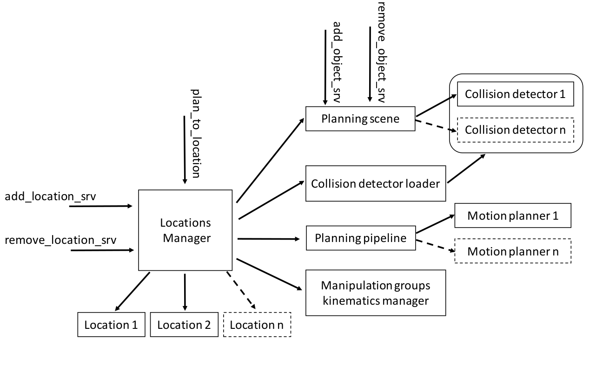
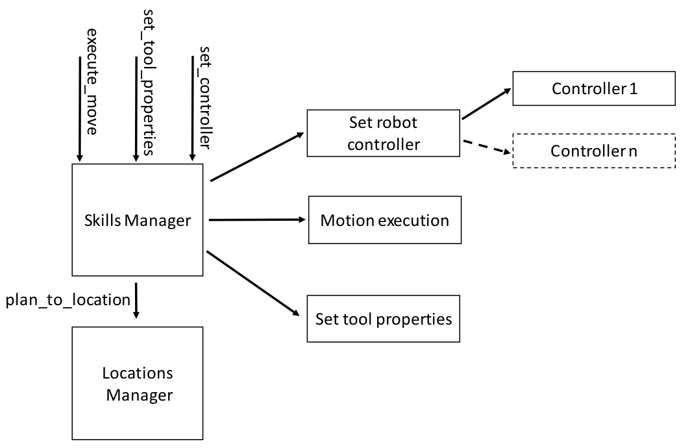
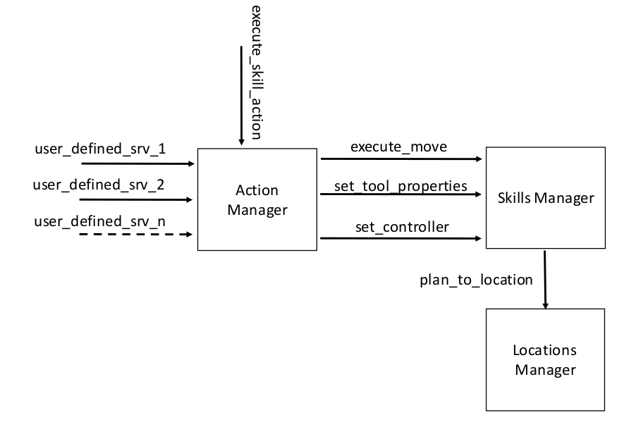

# manipulation_utils #

The manipulation_utils package contains all the basic modules to build a manipulation *Action*.

## Description

### Locations Manager module

All the object that need to be manipulated can be described by the data structure *Location* for a generic manipulation pose (position + orientation) (see [Location](../manipulation_msgs/msg)). The *Locations Manager* is the module that has in charge the management of multiple *Locations*.

The *Locations Manager* embeds a [*MoveIt!*](https://moveit.ros.org/) planning pipeline that enables the use the of multiple motion planners, a *MoveIt!* planning scene and a kinematics module able to compute the inverse kinematics of the overall robotic system for a given *Location*. Every time a new *Location* is added the inverse kinematics for a given move group (robotic arm + grasping system) is computed (with [*RosDyn*](https://github.com/CNR-STIIMA-IRAS/rosdyn) library instead of *MoveIt!* IK functions) and stored. The planning scene is evaluated only one time before planning a new trajectory, the online trajectory replanning is not supported, when a new trajectory planning is required the planning scene is updated and used to generate a collision-free trajectory avoiding collisions between the robotic system and all the entities in the planning environment. The motion planners can be loaded as ROS plugins. In the same way collision detectors can be changed online.

A *Locations Manager* can handle multiple move groups. The planning scene is unique and shared between multiple *Locations Manager*, objects can be dynamically added or removed depending on the real scene evolution, a perception system can be used to this scope.

### Skills Manager module

The *Skills Manager* module allows to dynamically load/unload the robot controllers (through the [cnr_ros_control](https://github.com/CNR-STIIMA-IRAS/cnr_ros_control) package) depending on the required robot behavior during the execution of a specific *Skill*. The module allows to start and monitor the execution of the trajectories planned by the *Locations Manager* for a specific move group and enables the control of the tool required by the *Actions*. The trajectory execution is controlled through a control_msgs::FollowJointTrajectoryAction, the enabled controller need to provide a FollowJointTrajectoryAction server.

### Action Manager module and manipulation framework pipeline

The *Action Manager* ground on the top of the modules *Skills Manager* and *Locations Manager* defining the following pipeline:

The *Action* need to be defined by the user, as for the services to interact with the module. Once a new action is taken in charge, the *Action Manager* module supervises the action execution, checks if all the *Skills* are properly completed and partially manages unexpected behaviors, if severe errors occurs an error message is returned to the action planner and the action execution is interrupted.

## Services

### Locations Manager module

The *Location Manager* module provide the following actions/services servers:

| Services | Type | Description |
|:--- | :----  | :------------------ |
| `add_locations` | manipulation_msgs::AddLocations | To add a list of locations from the *Locations Manager* |
| `remove_locations` | manipulation_msgs::RemoveLocations | To remove a list of locations from the *Locations Manager* |

### Action *PickObjects*

The *PickObjects* module provide the following actions/services servers:

| Actions | Type | Description |
|:--- | :----  | :------------------ |
| `GROUP_NAME/pick` | manipulation_msgs::PickObjects | Standard action, used to pick an object from a box |

| Services | Type | Description |
|:--- | :----  | :------------------ |
| `add_boxes` | manipulation_msgs::AddBoxes | To add a list of boxes |
| `remove_boxes` | manipulation_msgs::RemoveBoxes | To remove a list of boxes |
| `add_objects` | manipulation_msgs::AddObjects | To add a list of objects to a specific box N.B. an object need to be always contained in a box |
| `remove_objects` | manipulation_msgs::RemoveObjects | To remove a list of objects from all the available boxes  |
| `list_objects` | manipulation_msgs::ListOfObjects | To get a list of all the objects available for picking providing the names and the types |
| `inbound/reset_box` | manipulation_msgs::ResetBoxes | To reset all the objects in a list of boxes |

### Action *PlaceObjects*

The *PlaceObjects* module provide the following actions/services server:

| Actions | Type | Description |
|:--- | :----  | :------------------ |
| `GROUP_NAME/place` | manipulation_msgs::PlaceObjects | Standard action. Used to place an object in a slot |

| Services | Type | Description |
|:--- | :----  | :------------------ |
| `add_slots_group` | manipulation_msgs::AddSlotsGroup | To add a list of slots groups |
| `remove_slots_group` | manipulation_msgs::RemoveSlotsGroup | To remove a list of slots groups |
| `add_slots` | manipulation_msgs::AddSlots | To add a list of slots N.B. a slot need to be always contained in a group |
| `remove_slots` | manipulation_msgs::RemoveSlots | To remove a list of slots |
| `remove_obj_from_slot` | manipulation_msgs::RemoveObjectFromSlot | To remove a single object from a specific slot  |
| `outbound/reset_slot` | manipulation_msgs::ResetSlots | To reset a list of slots from the objects contained |

### Action *GoToLocations*

The *GoToLocation* module provide the following actions/services servers:

| Actions | Type | Description |
|:--- | :----  | :------------------ |
| `GROUP_NAME/go_to` | manipulation_msgs::GoTo | Standard action. Used to move a group in a position |

## Work in progress
The manipulation framework package is continuosly evolving. If you find errors or if you have some suggestions or if you want to contribute  [please let us know](https://github.com/JRL-CARI-CNR-UNIBS/manipulation/issues).

## Developer Contact
**Authors:**   
- Enrico Villagrossi (enrico.villagrossi@stiima.cnr.it)  
- Manuel Beschi (manuel.beschi@unibs.it)  

_Software License Agreement (BSD License)_    
_Copyright (c) 2021, National Research Council of Italy, Institute of Industrial Technologies and Automation_    
_All rights reserved._
