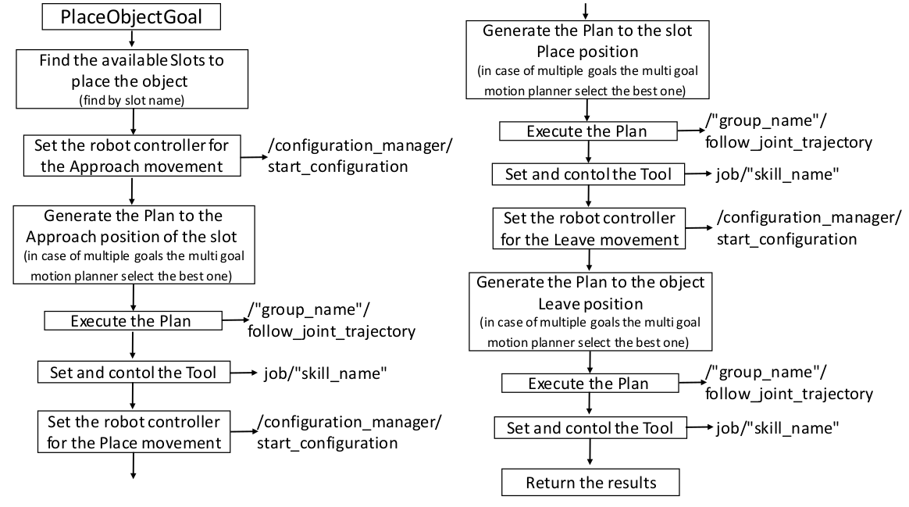

# outbound_place #

Examples nodes to create a:

- *PlaceObject* action server node
- *PlaceObject* action client node
- *PlaceObject* loader node

All the available action and services for *PlaceObject* *Skill Action* are described [here](../manipulation_utils/README.md).

The *Sub Actions* of the PlaceObject *Skill Action* are described below:

## Work in progress
The manipulation framework package is continuosly evolving. If you find errors or if you have some suggestions or if you want to contribute [please let us know](https://github.com/JRL-CARI-CNR-UNIBS/manipulation/issues).

## Developer Contact
**Authors:**   
- Enrico Villagrossi (enrico.villagrossi@stiima.cnr.it)  
- Manuel Beschi (manuel.beschi@unibs.it)  

_Software License Agreement (BSD License)_    
_Copyright (c) 2021, National Research Council of Italy, Institute of Industrial Technologies and Automation_    
_All rights reserved._
